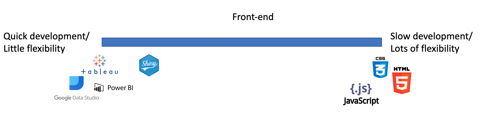
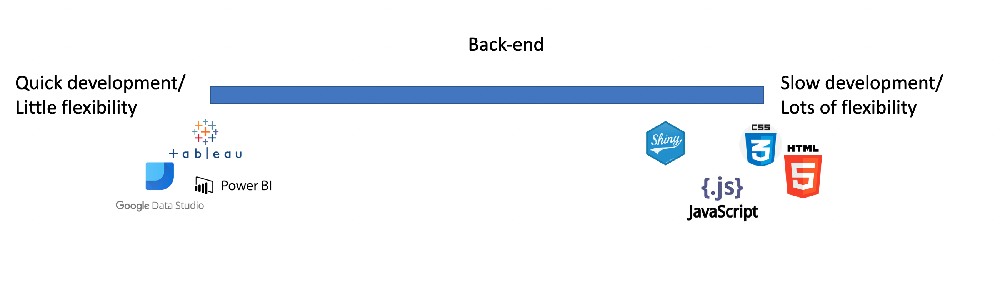

```{r setup, include=FALSE}
knitr::opts_chunk$set(echo = TRUE)
```

## What is Shiny?

From the Shiny website:

*Shiny is an R package that makes it easy to build interactive web apps straight from R. You can host standalone apps on a webpage or embed them in R Markdown documents or build dashboards. You can also extend your Shiny apps with CSS themes, htmlwidgets, and JavaScript actions.*

## Shiny is unique

```{r, out.width="100%", echo=FALSE}


```

## What is Shiny?

To me:

*An environment in which I can build dashboards without needing any frontending knowledge, but with a full programmatic background. Giving me the full flexibility, not limited to SQL-like tabular data structures.*

## For what is Shiny used?

* Professional Shiny consultants implement prod dashboards in organisations

* In acedemia, research projects

* Communication of machine learning results

* Prototyping of data-drive products

## Examples

https://shiny.rstudio.com/gallery/

http://192.168.214.220:3838/

Annual Shiny contest

## How it works

**ui** 

- frontend component
- here everything is defined that is user facing
- defined as an *object* in an R script (static)
- ui is very basic by default, but you can do a lot within ui and by adding css

**server**

- backend component 
- all calculations are done here
- defined as a *function* in an R script (dynamic)
- fully operative R session

## Shiny's "Hello, world!"

```{r, eval = FALSE}
library(shiny)

ui <- fluidPage(
  "Hello, world!"
)

server <- function(input, output, session) {
}

shinyApp(ui, server)
```

## Before we delve deeper...

You need to know a little R.

You can of course google how-to, but a little context and R quirks.

R is designed by data people for data people.

As a result it is very powerful for data analysis and... quite quirky (downright ugly at times).

## R quirks

- A `.` is perfectly fine in a variable name.

- The `$` is used to extract an element from an object. For data frames: `<df_name>$<col_name>`.

- The `<-` is used as assignment operator, later `=` was introduced too.

- There are no scalars, everything is a vector (think lists in python). All base R functions are *vectorised*, you get the looping for free. 

```{r}
c(1, 2, 3, 4) + 1
```

## R's black magic

Non-standard evaluation (or lazy evaluation): package developers can allow user to pass names to the functions that are not defined and that are captured within the function.

Upside: API's can save keystrokes to a minimum, which is great for data analysis.

Downside: you need to understand the API, knowing R is not enough.

```{r}
x <- data.frame(a = 1:4, b = 5:8)
subset(x, a < 3)
```

## Loading packages

When you want to use a package, you can either add all the objects from that package to the namespace:

```{r, eval=FALSE}
library(dplyr)
filter()
```

or access the packages namespace directly (no need for importing)

```{r, eval=FALSE}
dplyr::filter()
```

## The *tidyverse*

Revolutionary set of packages all maintained by an *Rstudio* team. Looking to resolve R's ugliness:

`dplyr`: sql-like operations in separate functions chained together with `%>%` (pipe operator). Pure functions that always return a data frame.

- `select`: peel out columns from data frame.
- `mutate`: add columns from the data frame that are derived from other columns
- `filter`: filter rows on a condition (like WHERE in SQL)
- `arrange`: sorting the data frame based on the values of one or more columns.
- `summarise`: apply aggregation functions.
- `group_by`: do any of the above on group level.

## The *tidyverse*

Other packages:

- `ggplot2`: plotting library
- `stringr`: string manipulations
- `readr`: reading and writing files
- `purrr`: reliably applying functions to multiple elements
- `forcats`: for working with *factors* (specific datatype)


## Communication between ui and server

To have a useful app, we want:

- to enable the user to specify input values 
- make calculations based on those input values
- return the calculation results in some digestible form to the user

## Specifying inputs

User chooses the inputs in *widgets*, these are implemented in R functions

Each widget function has `inputId` (communicate to server) and `label` (shown to user) as its first arguments.

```{r, eval=FALSE}
sliderInput("slider", 
            "A beautiful slider", 
            min = 0, 
            max = 100, 
            value = 50)
```

https://shiny.rstudio.com/gallery/widget-gallery.html

## Make calculations based on the input values

At the server side we can access the specified values in a *reactive context*. (Functions specified by Shiny).

We refer to the values with `input$<inputId>`, `inputId` is specified as the first arg of the widget function call.

```{r, eval=FALSE}
library(ggplot2)
output$plot <- renderPlot({
  samples <- runif(100, min = input$slider, max = 100)
  ggplot(data.frame(samples = samples), aes(samples)) +
    geom_histogram(col = "white")
  })
```

## Showing results 

Outputs are assigned in the `server` function as a slot to the `output` object, as `output$<outputId>`.

They are subsequently accessible in the `ui`, within the Shiny functions that show the output.

```{r, eval = FALSE}
plotOutput("plot")
```

## Combining the three to an app

```{r, eval=FALSE}
library(shiny)
library(ggplot2)
ui <-  fluidPage(
  sliderInput("slider", "A beautiful slider", 
              min = 0, max = 100, value = 50),
  plotOutput("plot")
)

server <- function(input, output, session) {
  output$plot <- renderPlot({
  samples <- runif(100, min = input$slider, max = 100)
  ggplot(data.frame(samples = samples), aes(samples)) +
    geom_histogram(col = "white")
  })
}

shinyApp(ui, server)
```

## Combining the three to an app

```{r, echo=FALSE}
library(shiny)
library(ggplot2)
ui <-  fluidPage(
  sliderInput("slider", "A beautiful slider", 
              min = 0, max = 100, value = 50),
  plotOutput("plot")
)

server <- function(input, output, session) {
  output$plot <- renderPlot({
  samples <- runif(100, min = input$slider, max = 100)
  ggplot(data.frame(samples = samples), aes(samples)) +
    geom_histogram(col = "white")
  })
}

shinyApp(ui, server)
```

## Using `reactive` for more complex apps

Most apps are centered around a single data frame, affected by multiple inputs, used by multiple outputs.

DRY solution: apply the manipulations at one place and apply everywhere.

Manipulation is done in `reactive` function and result is stored in an object.

Object is called like a function in other reactive contexts.

## `reactive` example

```{r, eval = FALSE}
df_reactive <- reactive({
  df %>% 
    filter(city == input$city,
           rent_or_buy == input$rent_or_buy) %>% 
    group_by(month) %>% 
    summarise(time_stat = ifelse(input$stat == "median",
                                 median(time_to_sell),
                                 mean(time_to_sell)))
})

output$plot <- renderPlot({
  ggplot(df_reactive(), aes(month, time_stat)) + geom_line()
})

output$table <- renderTable({
  df_reactive() %>% select(month, time_stat)
})
```

## Try it yourself

Go to: https://git.funda.nl/projects/DAR/repos/knowledge_share_shiny/browse

Clone the repo and follow the installation steps.

This will run a query on *odl_objects.fact_objects* and store the data on your machine.

If you can see the dashboard running:

1) Go over the code and see if you understand how it works
2) Adjust one thing that changes the dashboard
3) Add/replace a widget and adjust the reactivity
4) Add a second plot below the existing one.
5) Adjust the query, download the data and build a dashboard useful to you!

